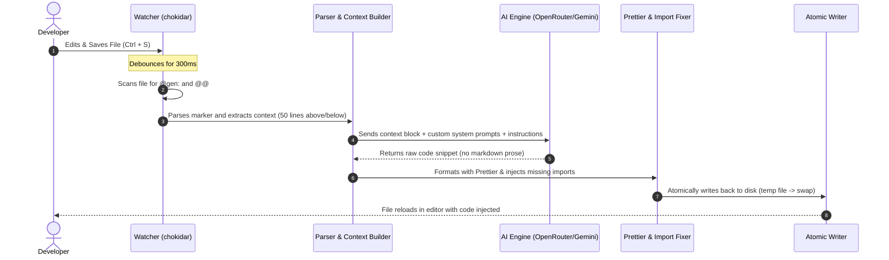

# 👻 ghost-ai

> **The background code quality daemon & inline generator for TypeScript, JavaScript, and Java projects.**  
> Write a simple instruction in a comment, hit save, and watch it turn into production-ready code in real-time.

[](https://www.npmjs.com/package/ghost-ai)
[](https://github.com/A-RYAN-KR/ghost-ai/blob/main/LICENSE)
[](https://github.com/A-RYAN-KR/ghost-ai/pulls)

---

## ✨ What is ghost-ai?

`ghost-ai` is a lightweight, background-running developer productivity daemon. You write a special comment starting with `// @gen:` and ending with `@@` anywhere in your code. When you hit **Save**, the daemon instantly detects the marker, retrieves the surrounding lines as context, calls an LLM backend (like OpenRouter or Gemini), and replaces the comment block with clean, formatted, fully integrated code.

---

## 🚀 Key Features

*   **⚡ Real-Time Inline Generation**: Simply type your request in-file and hit **Ctrl+S** (Save).
*   **🛠️ Language-Agnostic Context Rules**: Native assistance tailored for:
    *   **Frontend**: TypeScript, JavaScript, TSX, JSX, HTML5, CSS3, SCSS, Sass.
    *   **Backend**: Java (Spring Boot), Kotlin (Spring Boot), PHP 8+, Node.js (Express.js).
    *   **Others**: SQL, Bash, JSON, XML, YAML.
*   **🧩 Smart Auto-Import Injector**: Automatically checks your JSX/TSX/JS/TS files and imports missing React components, hooks (e.g. `useState`, `useEffect`), or types without modifying existing imports.
*   **🎨 Prettier Integration**: The generated code matches your project's indentation level and is automatically formatted via Prettier (if enabled).
*   **🔄 Programmatic & CLI API**: Use it as a global CLI daemon, local project script, or import it directly as a Node.js library.
*   **🔒 Safe Atomic Writes**: To prevent file corruption, the tool writes to a temporary file first and performs an atomic swap.

---

## 📦 Installation

To start using `ghost-ai` in your projects, install it from npm:

### Global CLI Installation (Recommended)
Run the daemon globally to watch any directory on your computer:
```bash
npm install -g ghost-ai
```

### Local Dev Dependency
Keep your configuration locked to a specific workspace:
```bash
npm install --save-dev ghost-ai
```

---

## 🔧 Setup & Environment Variables

Create a `.env` file in the folder where you run the daemon (or configure your global system environment variables):

```env
# Required. Retrieve from https://openrouter.ai/keys
OPENROUTER_API_KEY=your_openrouter_api_key

# Optional. Defaults to "inclusionai/ling-2.6-1t:free"
AI_MODEL=inclusionai/ling-2.6-1t:free

# Optional. Generation temperature (0.0 for deterministic, 1.0 for creative). Default: 0.1
AI_TEMPERATURE=0.1
```

> [!NOTE]
> `ghost-ai` also falls back to check `GEMINI_API_KEY` if `OPENROUTER_API_KEY` is not set.

---

## 💡 How It Works & Usage

### 1. Start the Daemon
From your command line, launch the daemon on your target directories:

```bash
# Watch the current directory (default)
ghost

# Watch specific relative directories (e.g., source and library folders)
ghost ./src ./lib

# Or run via the full package name
ghost-ai ./src
```

### 2. Write an Instruction
In any watched file, add a comment marker of the form `// @gen: <your instruction> @@` (or `/* @gen: ... @@ */` / `<!-- @gen: ... @@ -->` for CSS, HTML, XML):

#### Before:
```tsx
import React from 'react';

export function Counter() {
  // @gen: Create a click counter using react state with styled increment and decrement buttons @@
}
```

#### After (within seconds of pressing Save):
```tsx
import React, { useState } from 'react';

export function Counter() {
  const [count, setCount] = useState(0);

  return (
    <div style={{ display: 'flex', gap: '8px', alignItems: 'center' }}>
      <button onClick={() => setCount(count - 1)} style={{ padding: '8px 12px' }}>
        -
      </button>
      <span>{count}</span>
      <button onClick={() => setCount(count + 1)} style={{ padding: '8px 12px' }}>
        +
      </button>
    </div>
  );
}
```
*Notice that `useState` was automatically added to the existing React imports line!*

---

## 🏗️ Technical Architecture

Here is the lifecycle of a code generation action when you save a file:



---

## 💻 CLI Command Reference

Configure `ghost-ai` on-the-fly using the following flags:

| Short Flag | Long Flag | Description | Default Value |
| :--- | :--- | :--- | :--- |
| `-d` | `--dir` | Target directory to watch (can specify multiple times) | `process.cwd()` |
| | `--ext` | Comma-separated list of file extensions to track | `.tsx,.ts,.js,.jsx,.java` |
| | `--context` | Lines of surrounding code context sent to the model | `50` |
| | `--no-prettier` | Disables Prettier code styling on output | `false` (Prettier on) |
| | `--silent` | Suppress standard log output to terminal | `false` |
| `-h` | `--help` | Show command helper manual | |

---

## 📂 Programmatic API Reference

You can import `ghost-ai` and run it from your own scripts or custom workflows:

```javascript
const { injectFile, startWatcher, parseGenMarkers } = require('ghost-ai');

// 1. Process a single file manually
async function runSingleFile() {
  await injectFile('/path/to/src/Component.tsx', {
    contextLines: 50,
    usePrettier: true,
    silent: false,
  });
}

// 2. Start the watcher programmatically in a script
function runWatcher() {
  startWatcher({
    watchDirs: ['/path/to/src'],
    extensions: ['.tsx', '.ts', '.js'],
    contextLines: 50,
    usePrettier: true,
    silent: false,
  });
}
```

---

## ⚙️ Running in the Background

Keep your `ghost-ai` service active 24/7 in your background.

### Using pm2 (Recommended for Windows / macOS / Linux)
```bash
# Install PM2 globally
npm install -g pm2

# Run daemon watching ./src
pm2 start ghost --name "ghost-coder" -- ./src

# Save PM2 state to launch on system reboot
pm2 save
pm2 startup
```

### Using nohup (Linux / macOS)
```bash
nohup ghost ./src > /dev/null 2>&1 &
```

---

## 📝 License

Released under the [MIT License](LICENSE). Contributions, bug reports, and suggestions are welcome!
